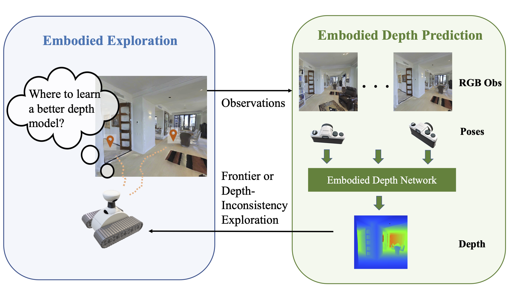

# Embodied Depth Prediction

https://embodied-depth.github.io

## Abstract

We study the problem of embodied depth prediction, where an embodied agent in an environment must learn to accurately estimate the depth of its surroundings. Such a task can be useful for embodied AI where it is highly desirable to accurately predict 3D structure when deploying robots in novel environments. However, directly using existing pre-trained depth prediction models in this setting is difficult as images are often captured in out-of-distribution viewpoints. Instead, it is important to construct a system that may adapt and learn depth prediction by interacting and gathering information from the environment and which may utilize the rich information in past observations captured from ego-motion. Towards this problem, we propose a framework for actively interacting with the environment to learn depth prediction, leveraging both explorations of new areas of space and exploration of areas of space where depth prediction is inconsistent. To exploit the rich information captured from past observations in the embodied setting, we further jointly utilize current and past image observations and their corresponding egomotions to predict depth. We illustrate the efficacy of our approach in obtaining accurate depth predictions in both simulated and real household environments.
